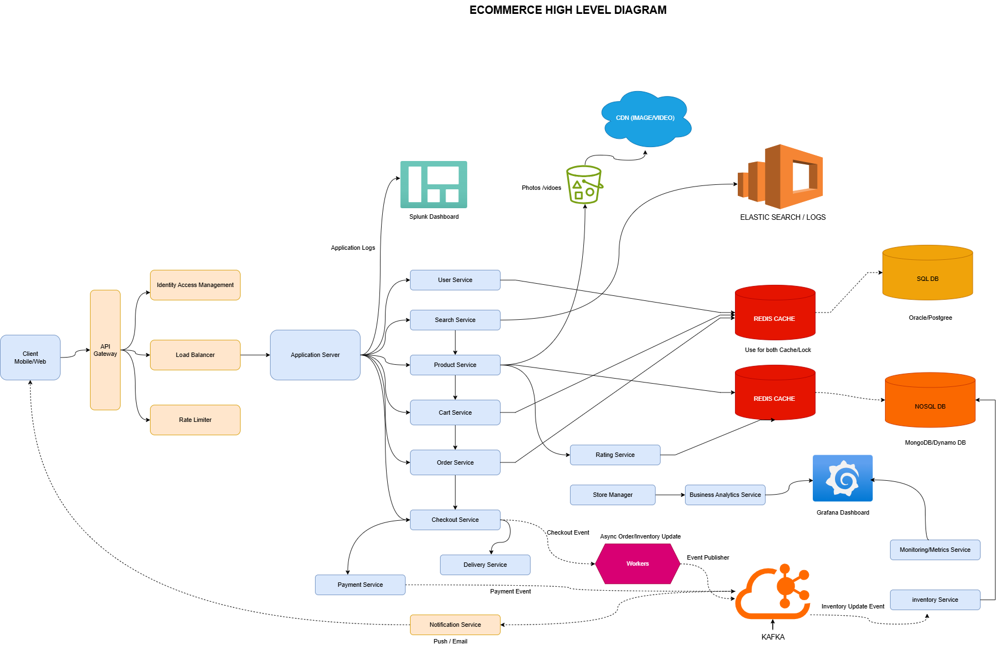

# 🛒 E-Commerce Platform

A scalable, modular e-commerce platform built using microservices architecture with Spring Boot, MySQL, Redis, Kafka, Elasticsearch, and other modern technologies.

---

## 🧩 Tech Stack

| Layer              | Technology                              |
|--------------------|------------------------------------------|
| Backend            | Spring Boot 3.x                          |
| Database           | MySQL, Redis                             |
| Messaging Queue    | Apache Kafka                             |
| Search Engine      | Elasticsearch                            |
| Streaming Engine   | Apache Flink (for real-time analytics)   |
| Object Storage     | AWS S3 or HDFS                           |
| API Documentation  | Swagger / SpringDoc                      |
| Auth & Security    | Spring Security + JWT                    |
| Monitoring         | Prometheus + Grafana                     |
| Observability      | OpenTelemetry, Jaeger                    |
| CI/CD              | GitHub Actions / Jenkins                 |
| Containerization   | Docker, Kubernetes (optional)            |

---

## 🧠 System Overview

This e-commerce system supports:

- Product Catalog
- User Management
- Cart & Order Management
- Payment Integration
- Real-time Order Tracking
- Advanced Search & Filtering
- Distributed Caching & Load Balancing
- Monitoring and Analytics

---

## 🗺️ High Level Design (HLD)

Below is the High-Level Architecture Diagram for this project:

---

## 📦 Project Structure

